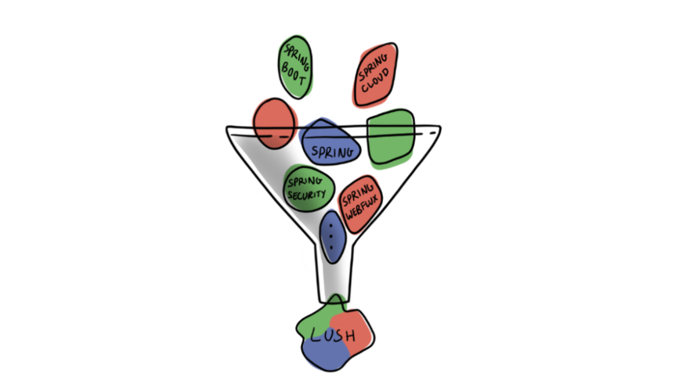
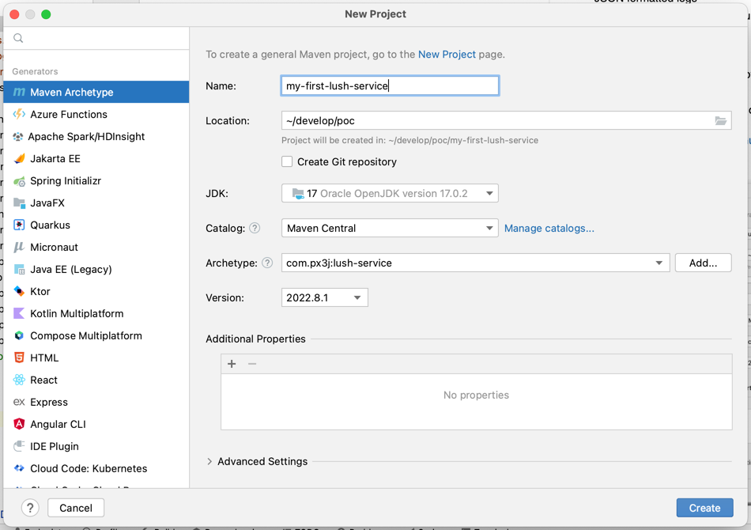

Do you build services in Java?  Are you building those services using Spring Boot, Spring Cloud and other pieces of the Spring Framework?  If so, then check out [Lush Service Architecture](https://github.com/paul-parrone/lush-core) - and get a head start on building production-ready services.

Lush is born of multiple iterations of service architecture that I have had the good fortune to build (on top of the vast Spring Framework) over the years.  If you think of it in visual terms, Lush is what comes out if we were to pour the entire Spring Framework through a **service architecture funnel**.

**Lush doesn't try to wrap or hide the Spring Framework at all, nor does it try to change the way we do things**.  It simply provides a pre-assembled set of components that already work together, thus giving you a head start at building production ready services.  If Spring is a bunch of individual blocks, Lush is a portion of those blocks partially assembled.

I've been fortunate to build quite a few systems from the ground up.  I have always found that there is a necessary amount of infrastructure code and design patterns/guidelines necessary to build consistent and reliable services.  Infrastructure that answers questions such as:

* What exception handling guidelines should the team follow - and how can we make it as seamless as possible?
* How can the maximum amount of boilerplate code be removed from the system - especially from developer responsibility?
* How can all endpoints return data and metadata consistently to service consumers (often a web based UI)?
* How should services be secured?
* How is user information (identifiers, roles, etc.) propagated into and across services?
* How should we make it as simple as possible for our support team to quickly find problems when things go wrong?

I believe that a service architecture should provide simple, understandable metaphors.  It strives to take common higher-level decisions out of developers hands - and does so as seamlessly as possible.  Lush is my technique to build something that does just these things.

With all of that said, lets get into some details.

## Overview
As stated earlier, think of Lush as a pre-assembled set of building blocks - below are the Spring components already integrated into Lush:

* **Spring Boot**
  * Nothing much to say here just that all Lush services are based on Spring Boot.

* **Spring WebFlux**
  * Simple annotation (**@LushControllerMethod**) to inject Lush behaviors into Controllers.
  * Automatically inject Lush Ticket and/or LushContext as desired.
  * Lush Advice is automatically propagated to the caller of the Controller method.
  * Lush provides automatic exception handling around Controller Endpoint methods.

* **Spring Security**
  * Spring Security preconfigured, Lush Ticket abstraction already integrated.
  * Configurable secure/insecure paths.
  * Seamless use of Spring Security related annotations (@PreAuthorize, @PostAuthorize).

* **Spring Cloud Discovery**
  * Discovery automatically enabled in all Lush Services.
  * For local development, Lush uses Consul for service discovery.

* **Spring Cloud Sleuth**
  * Already configured to capture the current user of a service.
  * Extra baggage field added so that original user is carried through all Lush service calls.

* **Spring Boot Actuator**
  * Already included in the starter and preconfigured.

In addition to the preconfigured Spring building blocks, Lush provides a number of other benefits:

#### Consistent Logging and Exception Handling
* Username present in and across all Lush service logs.
* Spring Cloud Sleuth is preconfigured - unique trace id is transferred across Lush Services.
* Leave the exception handling to Lush - your developers have enough to worry about.

#### General
* Maven Archetype makes it trivial quickly create a Lush service.
* Lush 'starter' POM to easily add Lush to any existing services.

#### Rich Protocol
* Based on Spring WebFlux
* Lush Advice - automatically provided by the architecture and sent back to callers
* JavaScript code to interpret and react to Lush Protocol.

#### Monitoring
* JSON formatted logs
* Spring Boot Actuator preconfigured

#### Aids in development
* Special **developer** profile to provide out-of-box settings when run on a developers computer.
* A **clear-ticket** profile to allow a clear text JSON Lush Ticket to access secured services.

Take a look at our [Getting Started Guide](http://www.github.com/paul-parrone/lush-core/blob/master/docs/getting-started.md) and see if Lush can help you!  This guide will take you through creating a Lush service of your own and explain Lush concepts in-depth.

